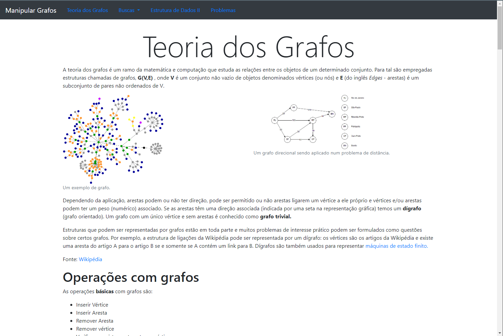
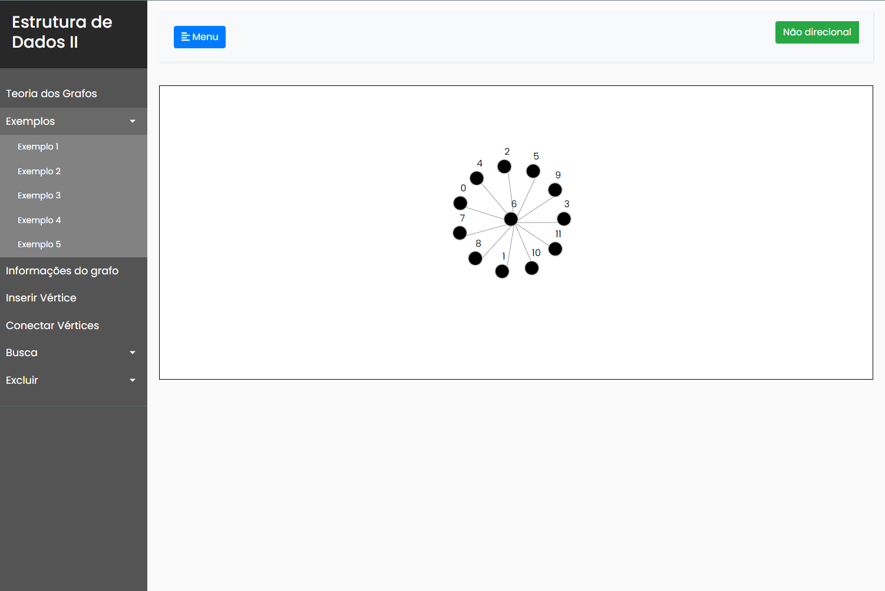
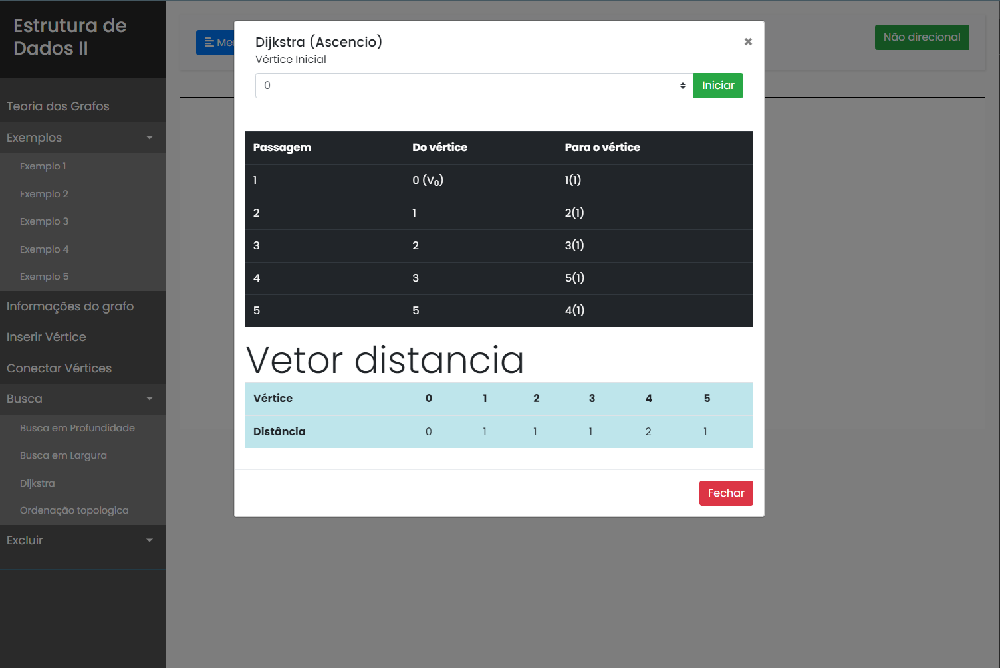

# Trabalho de Grafos

  

> Trabalho de grafos de Estrutura de dados II

 

[![Javascript][Javascript.com]][Javascript]

## Sobre o projeto 

Este é um trabalho feito para a máteria de Estrutura de Dados II ministrada pela professora Marcia A. Zanoli Meira e Silva, do curso de Bacharelado em Ciência da computação da Universidade Estadual Paulista "Júlio de Mesquita Filho" (UNESP) da cidade de Bauru.

## O que o trabalho pode fazer ?

O trabalho pode mostrar os grafos visualmente além de realizar as funções básicas de um grafo (inserir vértices, inserir aresta,...) como também pode realizar os 4 algoritmos de busca listado a seguir: 

- Busca em Profundidade 
- Busca em Largura 
- Ordenação topológica
- Algoritmo de Dijkstra

  
  

## 💻 Pré-requisitos

Pra rodar o projeto na máquina é possível utilizar: 

- Extensão do vscode [Live Server](https://marketplace.visualstudio.com/items?itemName=ritwickdey.LiveServer)
- Tendo node.js na máquina versão superior a 14 e rodar `npx lite-server`
